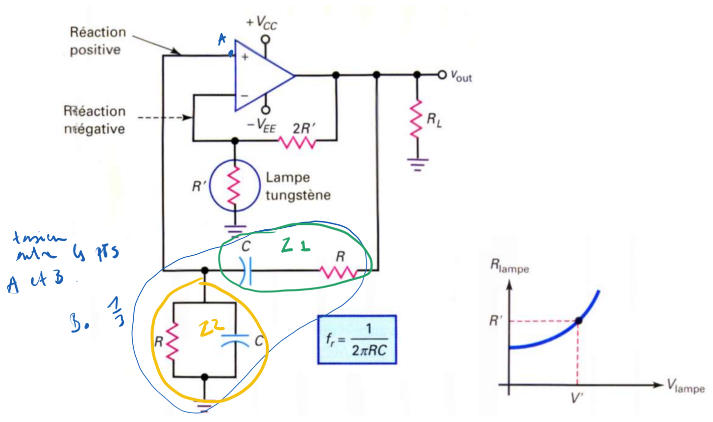

<h2><b>1. Oscillateur à pont de Wien {Chapitre 10}</b></h2>

### <em>Tracer le schéma d'un oscillateur à pont de Wien.</em>

_Le schéma complet se trouve à la page 3 (numérotée 116) dans la section 10.3.4._

Il est composé d'un amplificateur opérationnel avec deux boucles de réaction :

- Une boucle de réaction positive qui part de la sortie, traverse le circuit d'avance-retard (composé d'un condensateur et d'une résistance en série, et d'un condensateur et d'une résistance en parallèle) et va vers l'entrée non inverseuse.

- Une boucle de réaction négative qui part de la sortie, traverse un diviseur de tension (par exemple, une résistance 2R' et une lampe tungstène R') et va vers l'entrée inverseuse.

### <em>Enoncer le critère de Barkhausen appliqué à ce montage.</em>

Pour qu'il y ait oscillation, le produit des gains doit respecter le critère suivant (expliqué en page 1 et appliqué en page 4) : il faut que le gain de boucle A.B = 1 avec un déphasage nul.

### <em>Explique le principe avance retard de phase et situe la fameuse fréquence de coupure.</em>

Le principe (expliqué pages 2 et 3, section 10.3.3) repose sur le comportement des condensateurs selon la fréquence :

- Aux très basses fréquences : Le condensateur en série se comporte comme un circuit ouvert. Il n'y a pas de signal de sortie et le déphasage est positif (avance de phase).

- Aux très hautes fréquences : Le condensateur en parallèle se comporte comme un court-circuit. Il n'y a pas de signal de sortie et le déphasage est négatif (retard de phase).

- Entre ces deux extrêmes : La tension de sortie passe par un maximum. C'est à ce point précis que le déphasage est nul.La fameuse fréquence de coupure ($f_c$) correspond exactement à cette fréquence de résonance ($f_r$) où le déphasage est nul (démontré page 4, section 10.3.5).

### <em>Quelles sont les formules de la fc, A, et B (pas les démonstrations).</em>

D'après la page 4 (section 10.3.5), les formules à retenir sont :

- Fréquence de coupure ($f_c$) : $f_c = \frac{1}{2\pi RC}$

- Taux de réaction (B) : $B = \frac{1}{3}$ (à la fréquence de coupure)

- Gain de l'amplificateur (A) : Pour respecter $A.B = 1$, il faut que $A = 3$ (ce qui correspond à $A = 1 + \frac{R_2}{R_1}$).

### <em>Explique une des deux stabilisations d'amplitude. Explique avec les gains A et B.</em>

Explication avec la Méthode 1 (Lampe à tungstène) - page 4, section 10.3.6.1 :Pour que l'oscillation démarre, il faut initialement que le gain de boucle $A.B$ soit supérieur à 1.

- Au démarrage : La lampe à incandescence est froide, sa résistance est donc petite. La réaction négative est faible, ce qui rend le gain de l'amplificateur $A > 3$. Par conséquent, $A.B > 1$, et les oscillations apparaissent et croissent.

- Stabilisation : Au fur et à mesure que l'amplitude des oscillations augmente, le courant fait légèrement chauffer la lampe, ce qui fait augmenter sa résistance. Lorsqu'elle atteint la valeur exacte $R'$, le gain de l'amplificateur diminue et se stabilise exactement à $A = 3$. À ce moment-là, $A.B = 3 \times (\frac{1}{3}) = 1$. L'amplitude est stabilisée sans distorsion.

Vers [Question 2](../question-02/answer.md)
