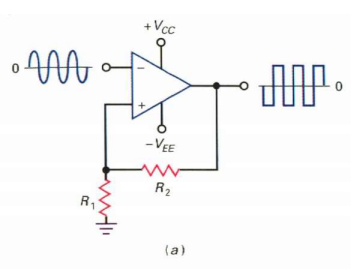
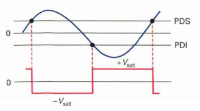

<h2><b>2. Conversion du sinusoïdal au carré {Chapitre 12}</b></h2>

### <em>Dessine le circuit qui réalise cette fonction.</em>

Le circuit qui réalise cette fonction s'appelle un comparateur (ou détecteur de passage par zéro). Selon la page 148, il s'agit simplement d'un amplificateur opérationnel connecté sans résistance de réaction.

<figure style="width: 50%; margin: 0 auto;">

  
</figure>

- Pour un comparateur non inversé : L'entrée inverseuse (-) est reliée à la masse (le point de référence à 0V), et le signal d'entrée ($v_{in}$) est appliqué à l'entrée non inverseuse (+).

- Pour un comparateur inversé : L'entrée non inverseuse (+) est reliée à la masse, et le signal d'entrée ($v_{in}$) est appliqué sur l'entrée inverseuse (-).

### <em>Dessine les signaux sur un diagramme temporel.</em>

Les diagrammes temporels se trouvent à la page 149 (figures a et b).

<figure style="width: 50%; margin: 0 auto;">

  
</figure>

- On y trace l'onde sinusoïdale d'entrée qui ondule autour de l'axe de 0V.

- On y trace superposée l'onde de sortie : c'est un signal rectangulaire franc, qui alterne entre une tension maximale ($+V_{sat}$) et une tension minimale ($-V_{sat}$).

- Le point crucial sur le diagramme est que le basculement vertical du signal de sortie se produit exactement à l'instant où la sinusoïde d'entrée coupe l'axe horizontal (le point zéro). Dans le cas d'un comparateur inversé, l'onde de sortie est déphasée de 180° par rapport à l'entrée.

### <em>Explique le fonctionnement de ce circuit en revenant au besoin sur les rappels de début de chapitre.</em>

- Rappel du principe (page 148) : La méthode repose sur l'absence de boucle de contre-réaction. Cela fait que l'amplificateur fonctionne avec son "gain en tension en boucle ouverte" ($A_{OL}$) qui est immense (ex: 100 000). De ce fait, la moindre différence de tension à l'entrée (aussi petite que 0,14 mV) est amplifiée de manière si importante qu'elle "sature" la sortie.

- Le fonctionnement (pages 148 et 149) : Le seuil de déclenchement est ici fixé à 0V (puisqu'une des pattes est à la masse). Lorsque le signal sinusoïdal est appliqué, la sortie n'a pas d'autre choix que d'être dans un de ses deux états extrêmes :
  - Dès que la sinusoïde passe légèrement au-dessus de 0V, le comparateur part en saturation positive ($+V_{sat}$).
  - Dès que la sinusoïde passe légèrement en dessous de 0V, il bascule instantanément en saturation négative ($-V_{sat}$).Puisque le signal d'entrée est périodique et traverse continuellement le zéro, la sortie bascule de bas en haut et de haut en bas à chaque traversée, créant ainsi une onde rectangulaire ou carrée parfaite.

Vers [Question 3](../question-03/answer.md)
