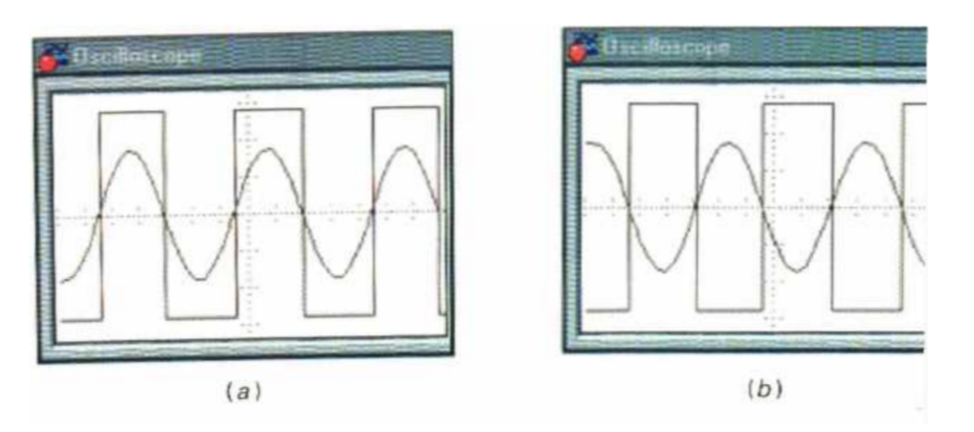

<h2><b>2. Conversion du sinusoïdal au carré {Chapitre 12}</b></h2>

### <em>Dessine le circuit qui réalise cette fonction.</em>

<figure style="width: 50%; margin: 0 auto;">

  
</figure>

### <em>Dessine les signaux sur un diagramme temporel.</em>

<figure style="width: 50%; margin: 0 auto;">

  
</figure>

### <em>Explique le fonctionnement de ce circuit en revenant au besoin sur les rappels de début de chapitre.</em>

- L'immense gain et la saturation (Rappel) : En l'absence de contre-réaction négative, le gain très élevé de l'AOP fait que la tension de sortie ne peut pas rester dans des valeurs intermédiaires. Dès que la tension d'entrée diffère de la tension de référence, la sortie "sature" instantanément aux limites de l'alimentation (+Vsat ou -Vsat). C'est ce phénomène qui explique pourquoi le signal de sortie est parfaitement plat et rectangulaire.

- ​La réaction positive : Contrairement à un simple détecteur de passage par zéro (qui bascule dès que le signal croise 0V en boucle ouverte), ce circuit utilise une réaction positive (la résistance R2 ramène une partie du signal sur l'entrée non inverseuse). Cela crée un effet d'hystérésis, définissant deux seuils distincts de basculement au lieu d'un seul.

- ​Le mécanisme de conversion : La bascule de Schmitt transforme l'onde sinusoïdale en signal carré en exploitant ces deux seuils. Quand la sinusoïde d'entrée monte et dépasse le Point de Déclenchement Supérieur (PDS), l'AOP sature brutalement à -Vsat. Lorsque l'alternance redescend et franchit le Point de Déclenchement Inférieur (PDI), la sortie retourne instantanément saturer à +Vsat.

C'est donc la combinaison du gain infini de l'AOP (qui garantit des états hauts et bas très stricts) et de la réaction positive (qui fixe les seuils PDS et PDI) qui permet cette conversion propre et périodique du sinusoïdal au rectangulaire.

Vers [Question 3](../question-03/answer.md)
