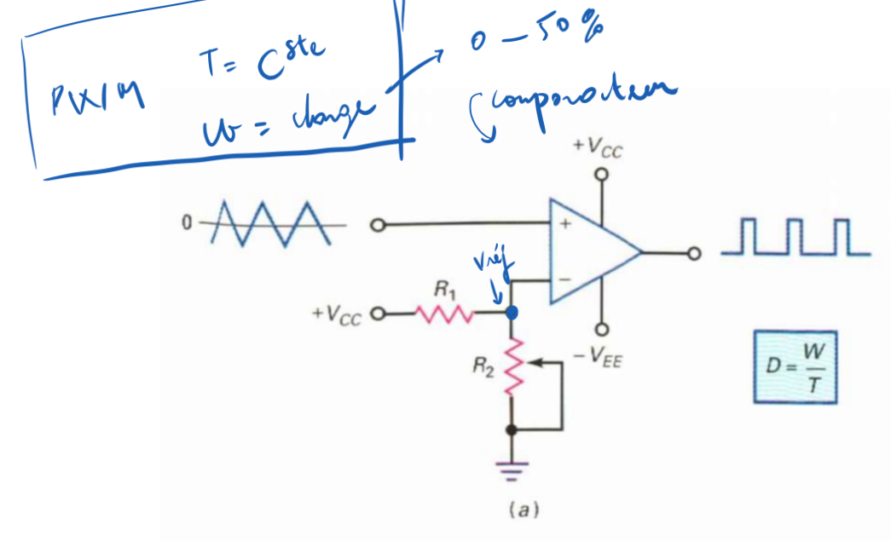
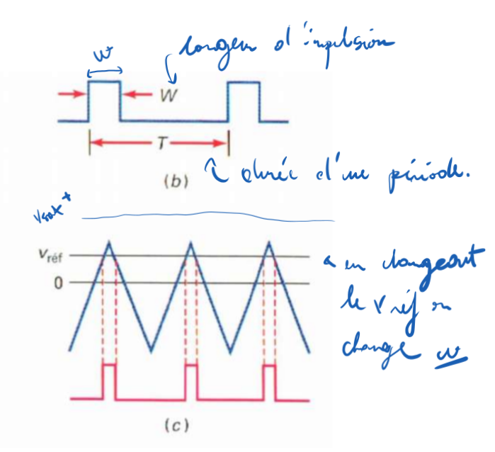

<h2><b>3. Conversion du triangulaire à l’impulsionnel. {Chapitre 12}</b></h2>

### <em>Dessine le circuit qui réalise cette fonction.</em>

Le montage (illustré à la figure a, page globale 162) est un comparateur configuré en détecteur à seuil variable.

Il se compose d'un amplificateur opérationnel sans boucle de contre-réaction. Le signal triangulaire d'entrée y est appliqué sur l'une des entrées. Sur l'autre entrée, on trouve un diviseur de tension formé par une résistance fixe ($R_1$) et une résistance variable ou potentiomètre ($R_2$), reliées à la tension d'alimentation ($+V_{CC}$ et la masse). Ce pont diviseur sert à créer la tension de référence ajustable.

### <em>Dessine les signaux sur un diagramme temporel.</em>

Les signaux à tracer correspondent aux figures b et c de la page globale 162.

- Sur le graphique du haut (figure c), on trace l'onde triangulaire d'entrée oscillant autour de 0V. On y superpose une ligne horizontale représentant la tension de référence de déclenchement ($v_{ref}$), située dans la partie positive du triangle.

- Sur le graphique du bas (figures b et c), on trace le signal de sortie. Il est à 0V la plupart du temps, mais forme des impulsions rectangulaires (de largeur $W$ et de période $T$) qui passent à l'état haut (ou positif) exactement aux instants où la pointe du signal triangulaire dépasse la ligne de seuil $v_{ref}$.

### <em>Explique le fonctionnement de ce circuit en revenant au besoin sur les rappels de début de chapitre.</em>

Comme expliqué dans les principes fondamentaux des comparateurs à valeur non nulle (page globale 150), en polarisant l'une des entrées avec un diviseur de tension, on déplace le point de déclenchement à une valeur $v_{ref}$ différente de zéro. Le comparateur compare alors en permanence le signal d'entrée à cette limite.

Dans ce montage spécifique (page globale 161) :

1. Le potentiomètre $R_2$ permet de faire varier manuellement le point de déclenchement ($v_{ref}$) de zéro jusqu'à une valeur positive donnée.

2. Chaque fois que la valeur du signal triangulaire franchit ce point de déclenchement en montant, la sortie du comparateur bascule au niveau haut. Elle repasse au niveau bas dès que le triangle redescend sous ce seuil.

3. Étant donné que la tension de référence $v_{ref}$ est ajustable, on peut décider à quelle "hauteur" du triangle le comparateur va déclencher.

4. Si l'on augmente $v_{ref}$ (en le rapprochant de la crête du triangle), le signal d'entrée ne le dépassera que brièvement : l'impulsion de sortie sera très fine. Si on diminue $v_{ref}$ (proche de zéro), l'impulsion sera plus large.

5. Cela permet donc de modifier la largeur de l'impulsion de sortie ($W$) sur une période ($T$). Autrement dit, ce circuit permet de faire varier le coefficient de remplissage (ou rapport cyclique, $D = W/T$) de 0 à 50 %.

Vers [Question 4](../question-04/answer.md)
