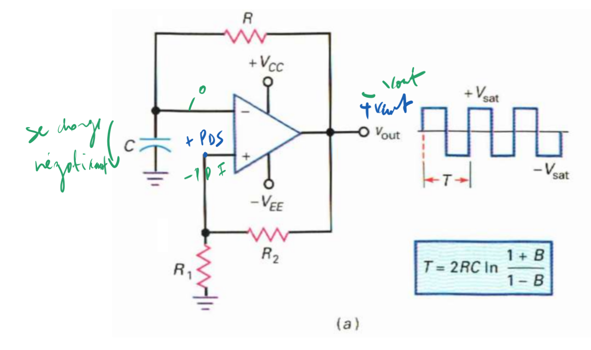
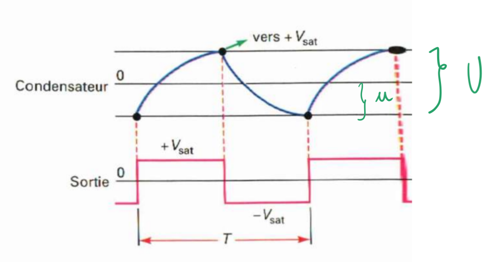

<h2><b>4. Générateur (oscillateur) à relaxation. {Chapitre 12}</b></h2>

### <em>Dessine le circuit qui réalise cette fonction.</em>

Le schéma se trouve à la page globale 164 (figure a). Il s'agit d'un amplificateur opérationnel avec une double boucle :

- Une boucle de réaction négative composée d'une résistance $R$ et d'un condensateur $C$ relié à la masse.

- Une boucle de réaction positive composée d'un diviseur de tension ($R_1$ et $R_2$) qui crée un effet d'hystérésis (bascule de Schmitt).

### <em>Quelle est la forme du signal produit ? Dessine les tensions sur un diagramme temporel.</em>

Le signal produit à la sortie est un signal rectangulaire (avec un coefficient de remplissage de 50%).

Sur le diagramme temporel (page globale 164, figure b):

- <b>En haut :</b> On trace la tension du condensateur ($v_c$). Elle a la forme de courbes exponentielles de charge et de décharge, qui oscillent strictement entre le point de déclenchement supérieur (PDS, noté $vers +V_{sat}$) et le point de déclenchement inférieur (PDI).

- <b>En bas :</b> On trace la tension de sortie ($v_{out}$), qui est une onde carrée franche alternant entre $+V_{sat}$ et $-V_{sat}$.

### <em>Explique le fonctionnement de ce circuit en revenant au besoin sur les rappels de début de chapitre.</em>

Bien qu'il n'y ait pas de signal d'entrée externe, ce circuit oscille de lui-même.

1. Supposons qu'au départ, la sortie soit à la saturation positive ($+V_{sat}$).

2. Le condensateur commence à se charger exponentiellement à travers la résistance $R$ en direction de $+V_{sat}$.

3. Cependant, il n'atteindra jamais cette tension. Dès que la tension du condensateur traverse le PDS (fixé par la boucle de réaction positive), le comparateur bascule brutalement et la sortie passe à $-V_{sat}$.

4. La sortie étant maintenant négative, le condensateur se décharge et commence à se charger négativement vers $-V_{sat}$.

5. Dès que sa tension traverse le PDI, la sortie commute à nouveau vers $+V_{sat}$, et le cycle se répète indéfiniment.

### <em>Donne les formules en relation avec cet oscillateur.</em>

D'après la page globale 164, les formules sont :

<b>Le taux de réaction ( $B$ ) :</b> $B = \frac{R_1}{R_1 + R_2}$

<b>La période du signal ( $T$ ) :</b> $T = 2RC \ln\left(\frac{1+B}{1-B}\right)$

### <em>Comment puis-je passer à un signal triangulaire ? Suite du schéma et explications.</em>

Pour obtenir un signal triangulaire, il faut mettre en cascade l'oscillateur à relaxation avec un intégrateur (page globale 164, section 12.4.1.2). Le schéma complet couple donc la sortie du premier AOP (l'oscillateur) à l'entrée du second AOP (l'intégrateur via une résistance $R_4$ et un condensateur $C_2$).

### <em>Explique le fonctionnement de ce circuit en revenant au besoin sur les rappels de début de chapitre. </em>

Le signal rectangulaire généré par le premier étage (l'oscillateur à relaxation) va servir à commander le second étage (l'intégrateur). Comme le signal d'entrée de l'intégrateur est une alternance de constantes ($+V_{sat}$ et $-V_{sat}$), l'opération mathématique d'intégration va transformer ces paliers constants en rampes linéaires (une pente montante puis une pente descendante). La succession de ces rampes crée à la sortie un signal triangulaire parfait.

### <em>Donne la formule de la valeur de la tension de sortie.</em>

La valeur crête à crête de ce signal triangulaire de sortie est donnée par la formule (page globale 164) :

$V_{out(pp)} = \frac{T}{2R_4 C_2} V_{sat}$

Vers [Question 5](../question-05/answer.md)
