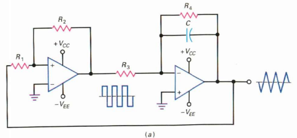
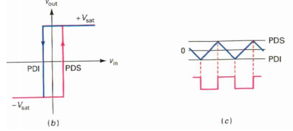

<h2><b>5. Il y a un autre schéma pour obtenir un signal triangulaire.{Chapitre 12}</b></h2>

### <em>Dessine le circuit qui réalise cette fonction.</em>

<i>Description :</i> Il s'agit d'un montage où la sortie rectangulaire d'une bascule de Schmitt non inverseuse est connectée à l'entrée d'un intégrateur. Le signal triangulaire produit par l'intégrateur est ensuite ramené (rebouclé) à l'entrée de la bascule de Schmitt.

### <em>Dessine les signaux sur un diagramme temporel.</em>

### <em>Explique le fonctionnement de ce circuit en revenant, au besoin, sur les rappels de début de chapitre.</em>

- Le fonctionnement repose sur l'interaction des deux étages : le premier commande le second, et inversement.  

- Supposons que la sortie de la bascule soit au niveau bas. L'intégrateur, recevant cette tension, produit une rampe positive.  

- Cette rampe de tension augmente jusqu'à ce qu'elle atteigne le point de déclenchement supérieur (PDS) de la bascule de Schmitt.  

- À cet instant précis, la sortie de la bascule commute brutalement au niveau haut. Cela force le signal triangulaire de l'intégrateur à inverser sa direction.  

- L'intégrateur produit alors une rampe négative qui décroît jusqu'à atteindre le point de déclenchement inférieur (PDI), ce qui provoque un nouveau basculement de la bascule.  

- Le cycle se répète. La différence de tension entre le PDS et le PDI détermine la valeur crête à crête du signal triangulaire produit.  

### <em>Démontre la formule de la fréquence de cet oscillateur. Pas le VCO.</em>

1. Relation des tensions de la bascule : La configuration donne $v_2 = \frac{v_1 - v_{out}}{2} + v_{out}$, ce qui se simplifie en $v_{out} = 2v_2 - v_1$.  

2. Conditions initiales : On suppose qu'à l'instant $t_0$, le condensateur est complètement déchargé et que la tension de sortie de la bascule vaut $v_1 = V_{ali}$.  

3. Équation de l'intégrateur : La formule classique de l'intégrateur est $v_{out} = \frac{-V_{ali}}{RC}t + k$. Puisque le condensateur est déchargé à $t_0$, la constante $k = 0$.  

4. Égalisation : En combinant les deux formules de $v_{out}$, on obtient : $2v_2 - V_{ali} = \frac{-V_{ali}}{RC}t$.  

5. Expression du temps $t$ : En isolant la variable temps, l'équation devient : $t = (\frac{2v_2 - V_{ali}}{-V_{ali}})RC$.  

6. Calcul du temps de basculement $t_1$ : Le basculement se produit au temps $t_1$, instant où la tension $v_2$ devient égale à $0\text{ V}$. En remplaçant $v_2$ par $0$, on trouve $t_1 = RC$.  

7. Période totale : D'après le diagramme temporel, la période complète $T_0$ correspond à quatre fois ce temps $t_1$, soit $T_0 = 4RC$.  

8. Fréquence finale : La fréquence étant l'inverse de la période, on arrive à l'expression finale : $f = \frac{1}{4RC}$.  

<!-- TODO: find images for this question -->

Vers [Question 6](../question-06/answer.md)
