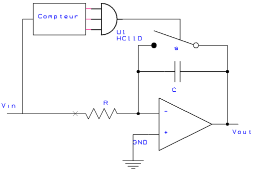
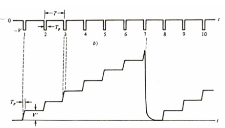

<h2><b>6. Générateur d’échelons (montage 1). {Chapitre 12}</b></h2>

### <em>À quoi sert-il ?</em>

Le circuit sert à générer une tension de sortie en forme de rampe positive en escalier (échelons). Pour y parvenir, on envoie à l'entrée du montage une série d'impulsions négatives.

### <em>Dessine le circuit qui réalise cette fonction.</em>

### <em>Dessine les signaux sur un diagramme temporel.</em>

- Le signal d'entrée ($t$ / $0$ à $-V$) : Il s'agit d'une succession d'impulsions de tension négative. La tension, initialement à 0, chute brutalement à $-V$ pendant une courte durée notée $T_{p}$. Ces impulsions se répètent régulièrement avec une période notée $T$.  

- Le signal de sortie ($t$ / $V_{out}$) : La courbe prend la forme d'un escalier ascendant. À chaque fois qu'une impulsion négative se présente à l'entrée, la tension de sortie s'élève d'un "pas" ou d'une marche (d'une hauteur $V'$). Entre deux impulsions d'entrée, la tension de sortie reste constante, formant un palier horizontal. Arrivée à une certaine hauteur (après 7 impulsions sur le schéma), la tension chute brusquement pour revenir à zéro, puis le cycle d'escalier recommence.  

### <em>Explique le fonctionnement de ce circuit en revenant, au besoin, sur les rappels de début de chapitre.</em>

Dans ce générateur d'échelons :

1. L'intégration (La montée) : Chaque impulsion négative envoyée à l'entrée est intégrée par le circuit. La pente de charge durant l'impulsion est égale à $V/RC$.  

2. La hauteur de la marche : L'intégration de cette impulsion sur la durée $T_{p}$ génère une marche dont la hauteur est donnée par la formule $V \cdot T_{p}/RC$.  

3. Le palier (La mémoire) : Entre les impulsions, la tension d'entrée est nulle. Le condensateur de l'intégrateur conserve sa charge, ce qui maintient la tension de sortie à un niveau constant jusqu'à l'impulsion suivante (rappel page 158 : lorsque l'impulsion est terminée, la charge est conservée et la tension reste constante).  

4. La remise à zéro : Bien que non détaillé textuellement, le schéma indique que le "Compteur" et la porte logique "HC11D" surveillent l'entrée et actionnent l'interrupteur $s$ pour court-circuiter et décharger le condensateur, ramenant brusquement la sortie à zéro.  

5. Défaut du montage : Le document précise que "la marche est oblique à cause de $RC$". Au moment de l'impulsion, la montée n'est pas parfaitement verticale en raison du temps de charge. L'auteur indique que "pour avoir moins de pente, on passe au montage suivant" (le générateur d'échelons à comparateur de mémoire).  

Vers [Question 7](../question-07/answer.md)
