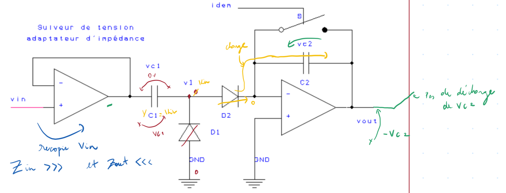
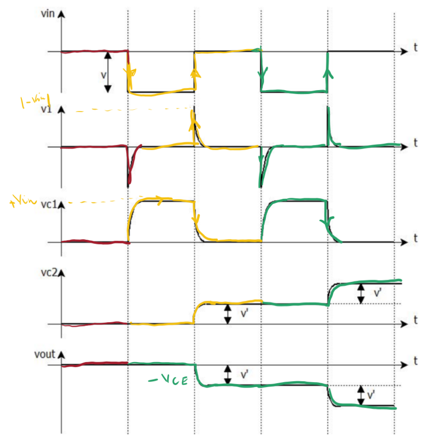

<h2><b>7. Générateur d’échelons à comparateur mémoire (montage 2). {Chapitre 12}</b></h2>

### <em>À quoi sert-il ?</em>

Ce circuit vient corriger le défaut du montage précédent, dont les pentes des marches étaient jugées obliques ou "pas assez raides". Ce montage amélioré est spécifiquement utilisé pour les oscilloscopes échantillonneurs, pour tracer des réseaux de caractéristiques courant-tension des transistors, et pour échelonner le courant de base ou de grille. (Pages 171 et 172)  

### <em>Dessine le circuit qui réalise cette fonction.</em>

### <em>Dessine les signaux sur un diagramme temporel.</em>

- $v_{in}$ : L'entrée est une série d'impulsions carrées descendantes (de $0$ à une valeur $-v$).  

- $v1$ : Cette tension forme des pics pointus (des "spikes"). Un pic vers le bas se crée au début de l'impulsion de $v_{in}$, et un pic vers le haut se forme à la fin de l'impulsion.  

- $vc1$ (tension sur $C1$) : Elle forme un créneau aux bords arrondis. Elle augmente pendant l'impulsion négative de $v_{in}$ et redescend à $0$ dès que $v_{in}$ remonte.  

- $vc2$ (tension sur $C2$) : Elle prend la forme d'un escalier qui monte. À chaque fin d'impulsion de $v_{in}$, $vc2$ s'élève brusquement d'un cran (d'une valeur $v'$) puis garde cette valeur en mémoire de façon parfaitement plate.  

- $v_{out}$ : La tension de sortie est le miroir parfait de $vc2$. Elle dessine un escalier descendant aux marches très nettes (de hauteur $v'$). (Page 171)  

### <em>Explique le fonctionnement de ce circuit en revenant, au besoin, sur les rappels de début de chapitre.</em>

1. État initial ($t_0$) : Les condensateurs $C1$ et $C2$ sont vides (déchargés) et les diodes $D1$ et $D2$ sont bloquées.  

2. Temps $t_1$ (Chute de l'impulsion) : Lorsque l'entrée $v_{in}$ devient négative ($-v$), la diode $D1$ devient passante. Le condensateur $C1$ se charge alors de façon presque instantanée (la constante de temps est très courte car elle ne dépend que de l'impédance de sortie de l'AOP et de la résistance interne de la diode). La tension $vc1$ atteint la valeur $V$.  

3. Temps $T_2$ (Fin de l'impulsion) : L'impulsion d'entrée se termine et $v_{in}$ remonte. C'est maintenant la diode $D2$ qui se met à conduire. Le condensateur $C1$ se décharge brutalement vers la masse virtuelle située à l'entrée inverseuse du second AOP.  

4. Transfert et mémoire : Toute la charge emmagasinée par $C1$ est transférée dans $C2$ selon la formule fondamentale $Q=C \cdot V$.  

5. Calcul de la hauteur de marche : L'égalité de transfert de charge s'écrit $C_1 \cdot V = C_2 \cdot V'$. La valeur de la tension qui s'ajoute à chaque palier est donc calculée par $V'=V \frac{C_1}{C_2}$.  

6. À la fin de ce processus très bref, la tension de sortie s'établit à $V_{out} = -V'$. L'AOP agit comme une mémoire et maintient ce palier horizontalement jusqu'à l'arrivée de la prochaine impulsion. (Page 172)  

Vers [Question 8](../question-08/answer.md)
