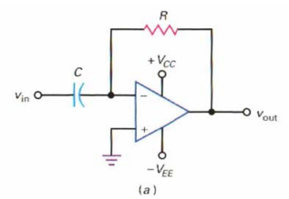
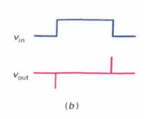
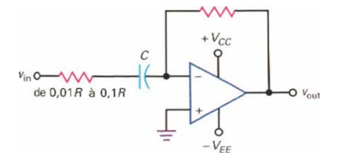
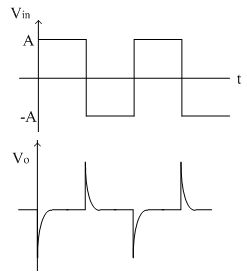

<h2><b>8. Le différenciateur. {Chapitre 12}</b></h2>

### <em>À quoi sert-il ?</em>

(page 174)

- Le différenciateur sert à réaliser l'opération mathématique de différentiation.  

- Sa tension de sortie est proportionnelle à la variation de la tension d'entrée par rapport au temps.  

- Il est utilisé pour détecter les variations rapides d'un signal, comme transformer un signal triangulaire en signal carré ou extraire les fronts d'un signal rectangulaire.  

### <em>Dessine le circuit de principe qui réalise cette fonction.</em>

### <em>Dessine les signaux sur un diagramme temporel.</em>

### <em>Explique le fonctionnement de ce circuit en revenant, au besoin, sur les rappels de début de chapitre.</em>

- L'entrée inverseuse de l'amplificateur est une masse virtuelle à 0V.  

- Tout le courant produit par les variations du signal d'entrée dans le condensateur est obligé de traverser la résistance de réaction.  

- La tension de sortie change donc uniquement quand le signal d'entrée varie, permettant de détecter et d'amplifier les changements brusques du signal.  

### <em>Dessine le schéma d’amélioration du différenciateur.</em>

### <em>Dessine les signaux sur un diagramme temporel.</em>

### <em>Explique le fonctionnement de ce circuit. Pas le 1.5.3.</em>

- L'ajout de la résistance modifie le comportement du circuit à très haute fréquence : il se comporte alors comme un simple amplificateur inverseur de gain au lieu d'un différenciateur pur.  

- Cela empêche le circuit d'amplifier indéfiniment le bruit et rend le montage beaucoup plus stable pour les applications réelles.  

Vers [Question 9](../question-09/answer.md)
