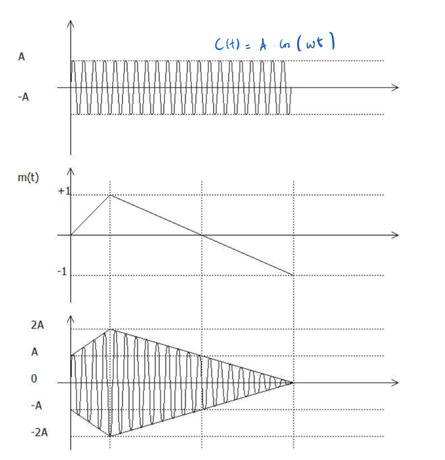

<h2><b>9. Modulation AM. {Chapitre 13}</b></h2>

### <em>En quoi consiste la modulation ?</em>

L'émetteur inscrit l'information provenant d'une source sur une porteuse sinusoïdale de fréquence $f_o$ : c'est cela la modulation. Pour inscrire cette information sur la porteuse, on peut faire varier soit son amplitude, soit sa fréquence, soit sa phase en fonction du signal à transmettre.

### <em>Qu’est-ce que la Am ?</em>

La modulation AM (pour Amplitude Modulation ou modulation d'amplitude) correspond à une modification de l'amplitude de l'onde porteuse par le signal information.

### <em>Qu’est-ce que m(t) ? (pas le développement, seulement sa signification et ces limites)</em>

- Signification : $m(t)$ est l'image du signal à transmettre.

- Limites : Le signal original est transformé (opération de cadrage) pour que $m(t)$ se retrouve strictement borné entre les valeurs +1 et -1.

### <em>Dessine un signal modulé en AM.</em>

Tu peux utiliser les schémas de la page globale 180 ou 183 pour ta réponse.

- Sur le diagramme temporel, on dessine une onde porteuse très rapide à l'intérieur d'une "enveloppe".

- Cette enveloppe externe varie lentement en reproduisant la forme exacte du signal modulant $m(t)$.

- Selon la page globale 183, l'amplitude globale de cette onde fluctue (par exemple entre $0$ et $2A$ pour la partie supérieure de l'enveloppe).

### <em>Montre par les calculs, le contenu du spectre AM ?</em>

Voici la démonstration mathématique issue de la page globale 184 :

Si on prend un signal $m(t) = M.\cos(\Omega t)$, Le signal modulé s'écrit : $v(t) = A.\cos(\omega t) + A.M.\cos(\Omega t).\cos(\omega t)$

En utilisant la formule trigonométrique :

$\cos(\alpha + \beta) + \cos(\alpha - \beta) = 2.\cos \alpha.\cos \beta$

On développe $v(t)$ pour obtenir le contenu spectral :

$v(t) = A.\cos(\omega t) + \frac{A.M}{2}.\cos(\omega + \Omega)t + \frac{A.M}{2}.\cos(\omega - \Omega)t$

(Cela montre bien la présence de la porteuse à la fréquence $\omega$, et de deux bandes latérales aux fréquences $\omega + \Omega$ et $\omega - \Omega$).

### <em>Quel est le problème de la AM ?</em>

Le problème principal est que les bandes latérales (qui contiennent la véritable information) sont de puissances bien plus faibles que le signal à la fréquence de la porteuse (qui, elle, ne contient pas d'information). En conséquence, il y a un important gaspillage d'énergie dans la transmission.

Vers [Question 10](../question-10/answer.md)
