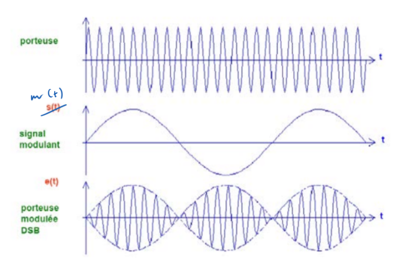

<h2><b>10. Modulation AM sans porteuse. {Chapitre 13}</b></h2>

### <em>En quoi consiste la modulation ?</em>

<b>(Page 179) :</b> C'est le fait d'inscrire une information (issue d'une source) sur une porteuse sinusoïdale de fréquence $f_o$ émise par l'émetteur.

### <em>Qu’est-ce que la Am ?</em>

<b>(Page 180) :</b> C'est un type de modulation qui correspond à une modification de l'amplitude de l'onde porteuse par le signal information.

### <em>Qu’est-ce que m(t) ? (pas le développement, seulement sa signification et ces limites)</em>

<b>(Page 182) :</b> C'est l'image du signal à transmettre. Il a subi un cadrage pour être strictement borné entre les valeurs $+1$ et $-1$.

### <em>Dessine un signal modulé en AM.</em>

Le diagramme temporel à dessiner se trouve à la page globale 187. Il faut tracer trois graphiques superposés :

<b>La porteuse :</b> Une onde sinusoïdale rapide et d'amplitude constante.

<b>Le signal modulant $s(t)$ :</b> Une onde sinusoïdale lente qui tourne (ondule) autour de l'axe des 0V.

<b>La porteuse modulée DSB :</b> Le signal résultant. Contrairement à l'AM classique, l'enveloppe touche le zéro. L'astuce visuelle indispensable à dessiner est le saut de phase : à chaque fois que le signal modulant $s(t)$ traverse la ligne du 0, les "vagues" de la porteuse modulée s'inversent (déphasage de 180°).

### <em>Pourquoi de la AM sans porteuse ?</em>

La réponse est donnée au tout début de la section 13.3.2 (page globale 187) : C'est "pour ne pas perdre de puissance avec la porteuse, pour ne pas dépenser cette puissance". En effet, la porteuse en elle-même ne contient aucune information utile, l'enlever permet de faire des économies d'énergie à l'émission.

### <em>Montre par les calculs, le contenu du spectre AM SANS PORTEUSE ?</em>

La démonstration mathématique (page globale 187) est la suivante :

1. Pour retirer la porteuse, on supprime le "$1+$" de la formule de l'AM classique. L'équation de départ devient donc :

   $v(t) = A \cdot m(t) \cdot \cos(\omega t)$

2. On remplace le signal modulant $m(t)$ par son expression $M \cdot \cos(\Omega t)$ :

   $v(t) = A \cdot M \cdot \cos(\Omega t) \cdot \cos(\omega t)$

3. En appliquant la formule trigonométrique, on obtient le contenu spectral final :

   $v(t) = \frac{A \cdot M}{2}\cos(\omega + \Omega)t + \frac{A \cdot M}{2}\cos(\omega - \Omega)t$

Conclusion : L'équation finale montre qu'il n'y a plus de composante à la fréquence $\omega$ isolée. Il n'y a plus la présence de la porteuse dans le signal, uniquement les deux bandes latérales.

Vers [Question 11](../question-11/answer.md)
