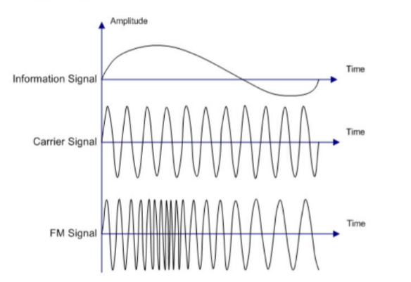

<h2><b>11. Les Modulation FM et PM. {Chapitre 13}</b></h2>

### <em>En quoi consiste la modulation ?</em>

Pour transférer un signal numérique par les ondes, on doit moduler ce signal (page globale 198). L'émetteur module le signal pour pouvoir le transporter à travers le canal. À l'autre bout, le récepteur démodule ce signal pour restituer le signal numérique (binaire) d'origine.

### <em>Qu’est-ce que la Fm ?</em>

La modulation FM (Modulation de Fréquence) correspond à une variation de la fréquence de l'onde porteuse par le signal information (page globale 180). Plus précisément (page globale 190), la valeur de la fréquence du signal varie autour de la fréquence de la porteuse ($f_o$), proportionnellement à la valeur du signal modulant $m(t)$. L'amplitude du signal, quant à elle, reste strictement constante.

### <em>Qu’est-ce que la PM (expliquer la différence).</em>

La modulation PM (Modulation de Phase) correspond à une variation de la phase de l'onde porteuse par le signal information (page globale 180). On fait varier l'angle de phase en fonction des fluctuations de la modulante (page globale 191).

- La différence visible (page globale 192) : Sur un diagramme temporel, si on compare la FM et la PM pour un même signal d'entrée sinusoïdal, on remarque un décalage. En PM, la fréquence la plus élevée (les "vagues" les plus serrées) est obtenue au moment d'un passage par zéro du signal d'information. En FM, les vagues les plus serrées sont obtenues au moment du sommet (l'amplitude maximale) du signal d'information.

### <em>Dessine un signal modulé en FM.</em>

Le diagramme à dessiner se trouve à la page globale 190. Il faut représenter trois axes temporels superposés :

1. Signal d'information (en haut) : Une sinusoïde lente oscillant autour de zéro.

2. Signal de la porteuse (au milieu) : Une sinusoïde très rapide, régulière et d'amplitude constante.

3. Signal FM (en bas) : Une onde d'amplitude constante, mais dont la fréquence varie. Les oscillations sont très serrées (haute fréquence) lorsque le signal d'information est à son maximum positif, et très espacées (basse fréquence) lorsque le signal d'information est à son minimum négatif.

### <em>Comment obtient-on une modulation FM ?</em>

On l'obtient en utilisant un VCO (Voltage Commanded Oscillator, ou Oscillateur commandé en tension), comme expliqué à la page globale 191.

- Schéma de principe : On additionne le signal modulant $s(t)$ avec une tension continue de référence ($V_o$). Cette somme entre dans le bloc VCO.

- Fonctionnement : La tension d'entrée détermine directement la fréquence de sortie. Le signal varie autour de la tension de référence $V_o$, ce qui fait que la fréquence de sortie varie proportionnellement autour de la fréquence centrale $f_o$.

### <em>Quelle est l’allure d’un spectre FM (pas de calculs, expliquer la porteuse et les bandes latérales).</em>

L'allure du spectre (décrite à la page globale 193) est complexe, mais voici ses caractéristiques principales à dessiner et expliquer :

- Le spectre est symétrique et centré sur la fréquence de la porteuse ($f_o$).

- Contrairement à l'AM qui n'a qu'une seule paire de bandes, la FM possède une "infinité" de bandes latérales (raies) de chaque côté.

- Les bandes latérales : Elles sont espacées régulièrement de part et d'autre de la porteuse, à des distances correspondant à des multiples de la fréquence du signal modulant $F$ (on trouve des raies à $f_o+F$, $f_o-F$, puis $f_o+2F$, $f_o-2F$, etc.).

- L'amplitude : L'amplitude de la porteuse centrale n'est pas constante (elle peut même s'annuler). L'amplitude de la porteuse et de chaque bande latérale dépend de courbes mathématiques appelées "fonctions de Bessel" (notées $J_0, J_1, J_2...$), qui varient en fonction de "l'indice de modulation".

Vers [Question 12](../question-12/answer.md)