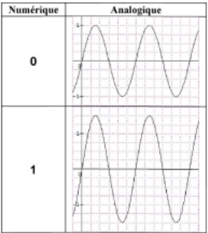
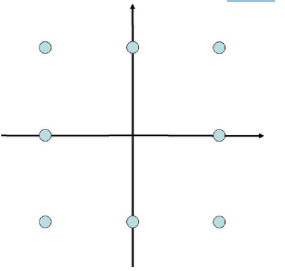

<h2><b>12. Les Modulation Numériques</b></h2>

### <em>En quoi consiste la modulation ?</em>

- La modulation consiste à faire varier un paramètre d'une porteuse sinusoïdale (amplitude, fréquence ou phase) en fonction d'un signal binaire (0 ou 1). 

- À l'émission, l'émetteur module le signal pour permettre son transport à travers le canal.  

- À la réception, le récepteur démodule le signal pour restituer le signal numérique (binaire) d'origine.  

### <em>Dessine un exemple des trois modulations numériques de base.</em>

 ASK

- ASK (Modulation d'amplitude) : L'amplitude de la porteuse varie selon l'état binaire.  FSK

- (Modulation de fréquence) : La fréquence de la porteuse change selon le bit transmis.  PSK 

- (Modulation de phase) : La phase de la porteuse subit un saut (ex: 180°) lors du changement de bit.  

### <em>Explique ces trois modulation numériques de base (jusque 14232 compris)</em>

- ASK (Modulation d'amplitude) : Pour un "1" logique, on transmet la porteuse avec une certaine amplitude, et pour un "0", l'amplitude est nulle.  

- FSK (Modulation de fréquence) : On définit deux fréquences distinctes : $f_1$ pour représenter le "1" et $f_2$ pour le "0", tandis que l'amplitude reste constante.  

- PSK (Modulation de phase) :

    - BPSK (13.4.2.3.1) : On code deux états. Le signal subit un saut de phase de 180° pour inverser le signal.  

    - QPSK (13.4.2.3.2) : Le signal analogique peut avoir 4 phases différentes, ce qui permet de coder deux bits à la fois.  

### <em>Qu’est-ce que la QAM ?</em>

- La QAM est une modulation hybride et très performante.  

- Elle combine simultanément une modulation d'amplitude (ASK) et une modulation de phase (PSK).  

- Elle permet de transmettre davantage de bits en même temps sur un seul symbole, augmentant ainsi considérablement le débit de données.  

### <em>Dessin de la 8QAM dans (X,Y) pas sinusoïdes et pas le reste.</em>

<!-- TODO: finish this question -->